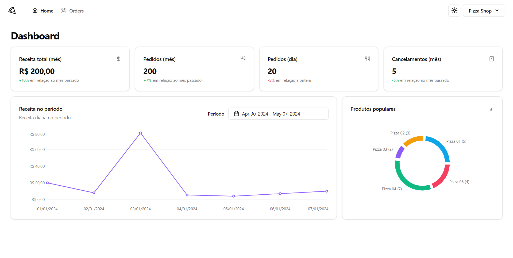

# Pizza Shop Web

## Table of contents

- [Overview](#overview) 
  - [The challenge](#the-challenge)
  - [Screenshot](#screenshot)
- [My process](#my-proccess)
  - [Built with](#build-with)
  - [Useful resources](#useful-resources)
- [Author](#author)

## Overview

### The challenge

Users should be able to:

- Sign in
- Sign up
- Update their personal information
- View detailed information on the Dashboard page
- Access detailed information about orders on the Orders page

### Screenshot

## My process

### Build with

- [TypeScript](https://www.typescriptlang.org/) - Typed programming language that builds on JavaScript
- [React.js](https://react.dev/) - JavaScript Library
- [Axios](https://axios-http.com/) - Amazing client HTTP library for web and node. 
- [Tanstack Query](https://tanstack.com/query/v3/) - Amazing and powerful asynchronous state management. 
- [Shadcn/ui](https://ui.shadcn.com/) - Styled, accessible and responsive components for building high‑quality web apps in React.
- [Tailwind CSS](https://tailwindcss.com/) - A amazing utility-first CSS framework.
- [Lucide React](https://lucide.dev/) - Beautiful & consistent icon library.
- [Sonner](https://sonner.emilkowal.ski/) - An opinionated toast component for React.
- [Zod](https://zod.dev/) - TypeScript-first schema validation with static type inference.

### Useful resources

- [Shadcn/ui](https://ui.shadcn.com/) - This is an amazing component library which helped me create accessible components. I'd recommend it to anyone still use this library.

## Author

- GitHub - [@rodrigoqueiroz12](https://github.com/rodrigoqueiroz12)
- LinkedIn - [@rodrigoqueiroz](www.linkedin.com/in/rodrigo-queiroz-a113a9212)
